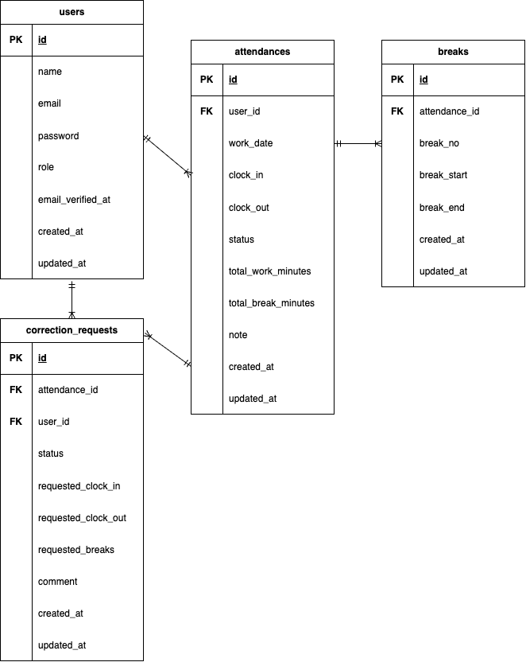

# attendance-app

## プロジェクト概要
勤怠管理アプリです。
- 一般ユーザーは出勤/退勤/休憩の打刻登録を行い、修正申請できます。
- 管理者ユーザーは全ユーザーの勤怠一覧確認、勤怠詳細の編集、修正申請の承認することができます。

## 環境構築
### リポジトリのクローン
1. git clone git@github.com:aki11-20/attendance-app.git

### Dockerビルド・起動
2. docker-compose up -d --build

### PHPコンテナ
3. docker-compose exec php bash

### Laravel環境構築
4. composer install
5. cp .env.example .env
6. php artisan key:generate

### マイグレーション&シーディング
7. php artisan migrate --seed

### .env設定
8. DB_CONNECTION=mysql
   DB_HOST=mysql
   DB_PORT=3306
   DB_DATABASE=laravel_db
   DB_USERNAME=laravel_user
   DB_PASSWORD=laravel_pass

   MAIL_MAILER=smtp
   MAIL_HOST=sandbox.smtp.mailtrap.io
   MAIL_PORT=2525
   MAIL_USERNAME=YOUR_MAILTRAP_USERNAME
   MAIL_PASSWORD=YOUR_MAILTRAP_PASSWORD
   MAIL_ENCRYPTION=tls
   MAIL_FROM_ADDRESS=test@example.com
   MAIL_FROM_NAME="${APP_NAME}"
## メール認証

mailtrapを使用してメール認証を実装しています。
会員登録後、認証メールが送信されます。

1. mailtrapにログインし、Integrationsから**Laravel7.x/8.x**を選択
2. 表示されるSMTP設定を`MAIL_MAILER`〜`MAIL_ENCRYPTION`まで`.env`に貼り付け
3. `MAIL_FROM_ADDRESS`には任意のメールアドレスを設定（例: test@example.com）
4. アプリで会員登録を行うとmailtrapのメールボックスで認証メールを確認できます

## 使用技術
- PHP 8.4.10
- Laravel 8.83.29
- Composer 2.8.12
- MySQL 8.0.36
- Nginx 1.21.1
- PHPUnit 9.6.29
- mailtrap

## ER図

## URL
- 開発環境: http://localhost
- phpMyAdmin: http://localhost:8080
- mailtrap: https://mailtrap.io

## テストアカウント
### 一般ユーザー
1. name: 西　伶奈
   email: reina.n@coachtech.com
   password: password123

2. name: 山田　太郎
   email: taro.y@coachtech.com
   password: password123

3. name: 増田　一世
   email: issei.m@coachtech.com
   password: password123

4. name: 山本　敬吉
   email: keikichi.y@coachtech.com
   password: password123

5. name: 秋田　朋美
   email: tomomi.a@coachtech.com
   password: password123

6. name: 中西　教夫
   email: norio.n@coachtech.com
   password: password123

### 管理者ユーザー
1. name: 管理者ユーザー
   email: admin@example.com
   password: password123

## PHPUnit
1. docker-compose exec mysql bash
2. mysql -u root -p
// パスワードは root と入力
3. create database test_database;
4. docker-compose exec php bash
5. php artisan migrate:fresh --env=testing
6. ./vendor/bin/phpunit

